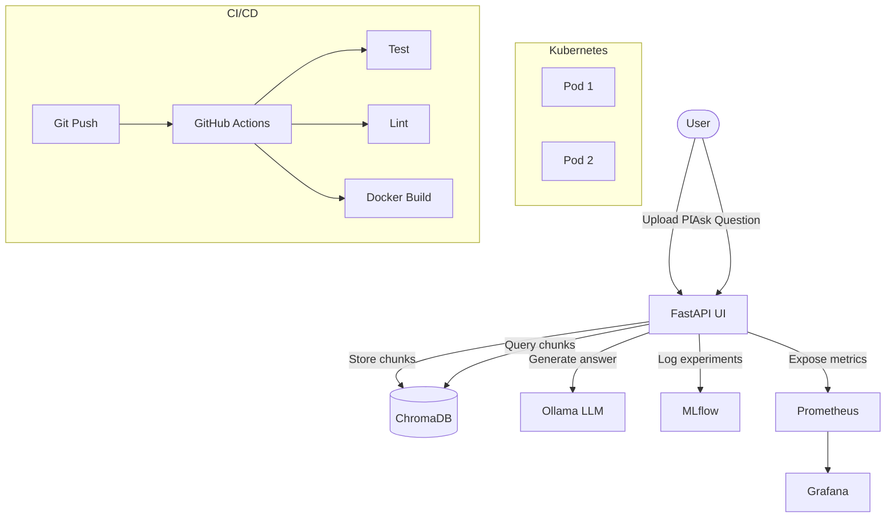

# RAG-Ops: Production-Grade Document Intelligence Platform

A production-ready Retrieval-Augmented Generation (RAG) system with a full MLOps lifecycle — built to demonstrate how AI applications are deployed, monitored, and maintained at scale.

> Upload any PDF. Ask anything. Backed by a complete MLOps pipeline.

---

## Live demo

[Screen recording / GIF here]

---

## What this project demonstrates

This is not a notebook demo. Every component reflects real production engineering practice:

| Layer | Technology | What it does |
|---|---|---|
| RAG pipeline | LangChain, ChromaDB, Ollama (Llama 3.2) | Ingests PDFs, retrieves relevant chunks, generates cited answers |
| Backend API | FastAPI | REST endpoints for upload and query |
| Experiment tracking | MLflow | Logs every ingest and query — chunk size, latency, retrieval metrics |
| Containerisation | Docker | Fully containerised, reproducible build |
| Orchestration | Kubernetes (minikube) | 2-replica deployment with readiness and liveness probes |
| Monitoring | Prometheus + Grafana | Real-time query latency, throughput, error rate dashboards |
| CI/CD | GitHub Actions | Automated testing, linting, and Docker build on every push |

---

## Architecture



---

## MLOps lifecycle

Every query is tracked as an MLflow experiment run with:
- Parameters: question, LLM model, embedding model, chunk size
- Metrics: retrieval latency, LLM latency, total latency, chunks retrieved

Every deployment goes through GitHub Actions CI before reaching Kubernetes:
- Pytest unit tests
- Ruff linting
- Docker image build verification

---

## Getting started

### Prerequisites
- Python 3.11+
- Docker Desktop
- Ollama with Llama 3.2: `ollama pull llama3.2`
- minikube (for Kubernetes)

### Run locally

```bash
# Clone
git clone https://github.com/songoku4/RagOps.git
cd RagOps

# Virtual environment
python -m venv venv
venv\Scripts\Activate.ps1  # Windows
pip install -r requirements.txt

# Start ChromaDB
chroma run --path ./chroma_db --port 8001

# Start MLflow
mlflow server --host 0.0.0.0 --port 5001

# Start app
uvicorn app.main:app --reload
```

Open `http://localhost:8000`

### Run with Docker

```bash
docker-compose up -d
```

### Deploy to Kubernetes

```bash
minikube start --driver=docker
minikube image build -t ragops-app:latest .
kubectl apply -f infra/k8s/
minikube service ragops-service --url
```

### Monitoring

| Service | URL | Credentials |
|---|---|---|
| Grafana | http://localhost:3000 | admin / ragops123 |
| Prometheus | http://localhost:9090 | - |
| MLflow | http://localhost:5001 | - |

---

## Project structure

```
ragops/
├── app/
│   ├── main.py          # FastAPI app, Prometheus metrics
│   ├── rag.py           # RAG pipeline, MLflow tracking
│   └── templates/
│       └── index.html   # UI
├── infra/
│   └── k8s/             # Kubernetes manifests
├── monitoring/
│   └── prometheus.yml   # Prometheus scrape config
├── tests/
│   └── test_api.py      # Pytest unit tests
├── docs/
│   └── architecture.md  # Architecture diagram
├── Dockerfile
├── docker-compose.yml
└── .github/
    └── workflows/
        └── ci.yml       # GitHub Actions CI pipeline
```

---

## Key outcomes from production experience

These numbers come from my previous role at Comviva (Tech Mahindra), where I applied the same patterns at scale:

- 40% reduction in deployment time through CI/CD automation
- 60% reduction in manual ML deployment effort via SageMaker Pipelines
- 15+ hours/week saved through Python and Lambda automation

---

## Tech stack


