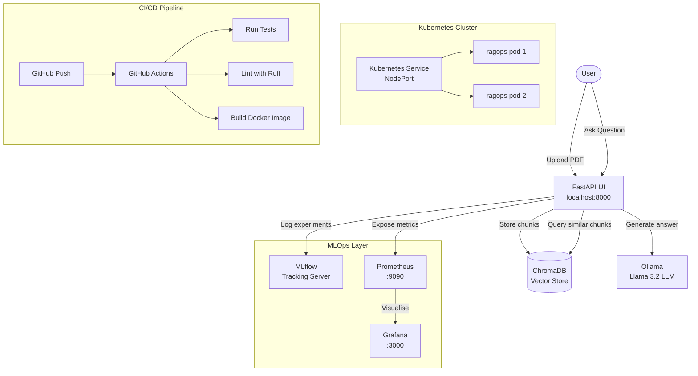

# RAG-Ops Architecture

```mermaid
graph TB
    User([User]) -->|Upload PDF| UI[FastAPI UI<br/>localhost:8000]
    User -->|Ask Question| UI

    UI -->|Store chunks| CDB[(ChromaDB<br/>Vector Store)]
    UI -->|Query similar chunks| CDB
    UI -->|Generate answer| OL[Ollama<br/>Llama 3.2 LLM]
    UI -->|Log experiments| ML[MLflow<br/>Tracking Server]
    UI -->|Expose metrics| PR[Prometheus<br/>:9090]
    PR -->|Visualise| GR[Grafana<br/>:3000]

    subgraph Kubernetes Cluster
        POD1[ragops pod 1]
        POD2[ragops pod 2]
        SVC[Kubernetes Service<br/>NodePort]
        SVC --> POD1
        SVC --> POD2
    end

    subgraph CI/CD Pipeline
        GH[GitHub Push] --> GA[GitHub Actions]
        GA --> T[Run Tests]
        GA --> L[Lint with Ruff]
        GA --> D[Build Docker Image]
    end

    subgraph MLOps Layer
        ML
        PR
        GR
    end
```